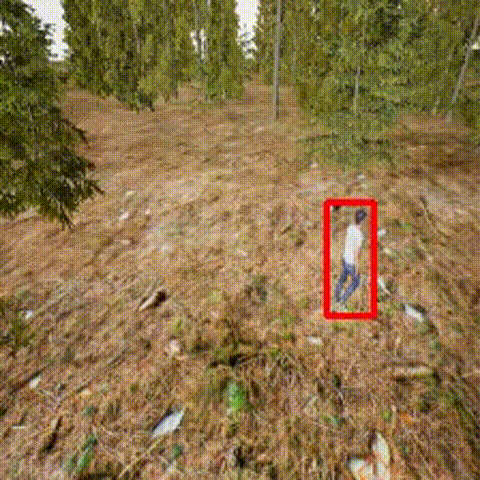

# Active tracking toolkit

This is a simple framework for evaluating tracking algorithms on 3D environments. Our 3D environments is built in Unreal Engine 4, and we utilize [gym_unrealcv](https://github.com/zfw1226/gym-unrealcv) as a python wrapper.



## Usage

### Prepare environments

We provide 2 environments available:

+ GeometryTrack (`UnrealTrack-GeometryTrackRam-DiscreteColor-v0`)
+ ForestTrack (`UnrealTrack-ForestTrack-DiscreteColor-v0`)

You can download the environments [here](https://drive.google.com/drive/folders/1jBMiEQP0SkO7ADOVmtqeYgFBkknKZVR8?usp=drive_link), unzip and put them in [./envs/gym_unrealcv/envs/UnrealEnv](./envs/gym_unrealcv/envs/UnrealEnv), then the preparation is done.

If you want to customize your own environments, please refer to [tutorial of gym_unrealcv](https://github.com/zfw1226/gym-unrealcv#customize-an-environment).

### Evaluate trackers

You can run `test.py` to test you tracker and use `--env` to specify the test environment. An example is as follows:

```bash
python test.py --env UnrealTrack-GeometryTrackRam-DiscreteColor-v0 --model_path [your model path]
```

For other options available, you can refer to the source code.

For trackers already integrated in our toolkit, you can get the pretrained weights from reference links.

### Add new trackers

If you want to test your own passive tracking method, you need to inherit the `TrackerBase` class defined in [`tracker.py`](./tracker.py). We follow a common setting that you need to override a `init()` function to get the tracking target as input and initialize your tracker, and a `track()` function to perform tracking.

Then, you can put your source code in the `trackers` folder and modify `__init__.py`, so that when testing, you can import your tracker class like:

```python
from trackers import TrackerSiamFC
```

You can refer to the SiamFC implementation as an example.

## Reference

UE4 environment wrapper: https://github.com/zfw1226/gym-unrealcv

SiamFC: https://github.com/huanglianghua/siamfc-pytorch

Transformer tracking(TransT): https://github.com/chenxin-dlut/TransT